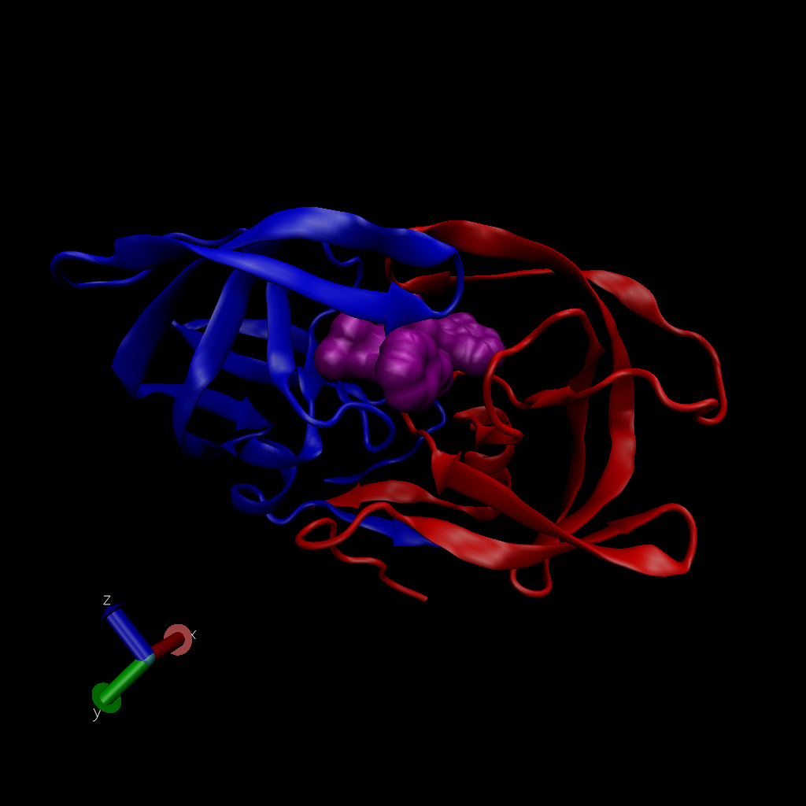

# The PDB database

```{r}
db <- read.csv("Data Export Summary.csv", row.names=1)
head(db)

```

> Q1. What percentage of structures in the PDB are solved by X-Ray and Electron Microscopy.

```{r}
(sum(db$X.ray)/ sum(db$Total)) *100
```

How about doing this over every method? (i.e. column in the little table)

```{r}
(colSums(db) / sum(db$Total))*100
```

> Q2: What proportion of structures in the PDB are protein?

```{r}
(db$Total[1] / sum(db$Total)) *100

(db[1,ncol(db)] / sum(db$Total)) *100

```

> Q3: Type HIV in the PDB website search box on the home page and determine how many HIV-1 protease structures are in the current PDB?

23,409 structures



> Q4: Water molecules normally have 3 atoms. Why do we see just one atom per water molecule in this structure?

Otherwise they would be so small and hard to visualize so it simplifies it some.

> Q5: There is a conserved water molecule in the binding site. Can you identify this water molecule? What residue number does this water molecule have (see note below)?

Within the conserved Aspertate...?

# Using Bio3D in R for structural bioinformatics

Do a Normal Mode Analysis (NMA) a prediction of the conformational variability and intrinsic dynamics of this protein.

```{r}
library(bio3d)

pdb <- read.pdb("1hel")

m <- nma(pdb)

plot(m)
```

Make a little movie (trajectory) for viewing in VMD.

```{r}
mktrj(m, file="nma.pdb")
```
