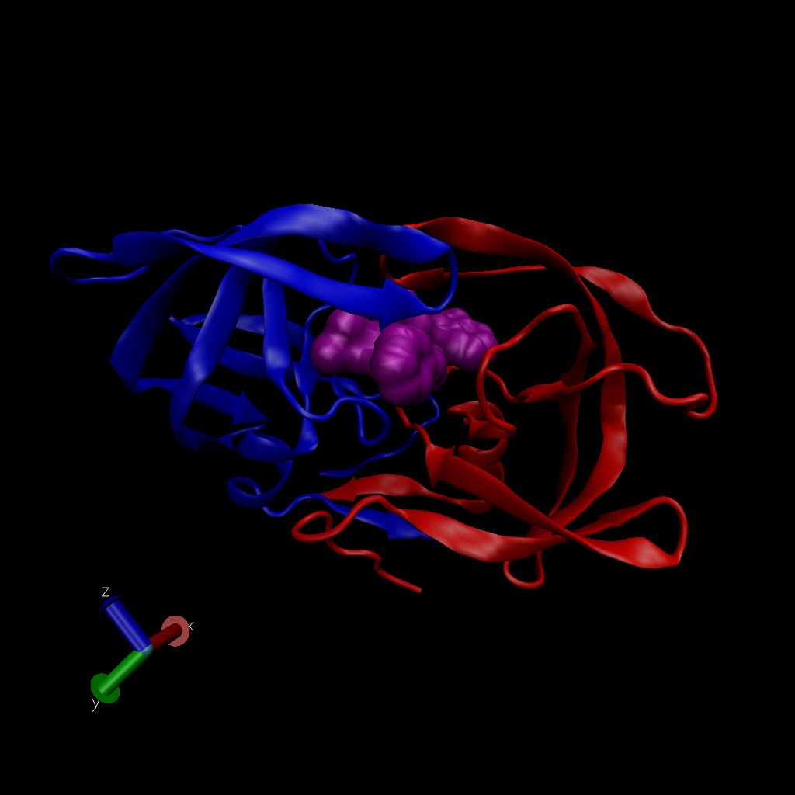

Structural Bioinformatics Part 1
================

# The PDB database

``` r
db <- read.csv("Data Export Summary.csv", row.names=1)
head(db)
```

    ##                          X.ray   NMR   EM Multiple.methods Neutron Other  Total
    ## Protein (only)          142419 11807 6038              177      70    32 160543
    ## Protein/Oligosaccharide   8426    31  991                5       0     0   9453
    ## Protein/NA                7498   274 2000                3       0     0   9775
    ## Nucleic acid (only)       2368  1378   60                8       2     1   3817
    ## Other                      149    31    3                0       0     0    183
    ## Oligosaccharide (only)      11     6    0                1       0     4     22

> Q1. What percentage of structures in the PDB are solved by X-Ray and
> Electron Microscopy.

``` r
(sum(db$X.ray)/ sum(db$Total)) *100
```

    ## [1] 87.52836

How about doing this over every method? (i.e. column in the little
table)

``` r
(colSums(db) / sum(db$Total))*100
```

    ##            X.ray              NMR               EM Multiple.methods 
    ##      87.52836071       7.35991033       4.94686958       0.10555353 
    ##          Neutron            Other            Total 
    ##       0.03917451       0.02013134     100.00000000

> Q2: What proportion of structures in the PDB are protein?

``` r
(db$Total[1] / sum(db$Total)) *100
```

    ## [1] 87.3499

``` r
(db[1,ncol(db)] / sum(db$Total)) *100
```

    ## [1] 87.3499

> Q3: Type HIV in the PDB website search box on the home page and
> determine how many HIV-1 protease structures are in the current PDB?

23,409 structures



> Q4: Water molecules normally have 3 atoms. Why do we see just one atom
> per water molecule in this structure?

Otherwise they would be so small and hard to visualize so it simplifies
it some.

> Q5: There is a conserved water molecule in the binding site. Can you
> identify this water molecule? What residue number does this water
> molecule have (see note below)?

Within the conserved Aspertate…?

# Using Bio3D in R for structural bioinformatics

Do a Normal Mode Analysis (NMA) a prediction of the conformational
variability and intrinsic dynamics of this protein.

``` r
library(bio3d)

pdb <- read.pdb("1hel")
```

    ##   Note: Accessing on-line PDB file

``` r
m <- nma(pdb)
```

    ##  Building Hessian...     Done in 0.035 seconds.
    ##  Diagonalizing Hessian...    Done in 0.063 seconds.

``` r
plot(m)
```

<!-- -->

Make a little movie (trajectory) for viewing in VMD.

``` r
mktrj(m, file="nma.pdb")
```
