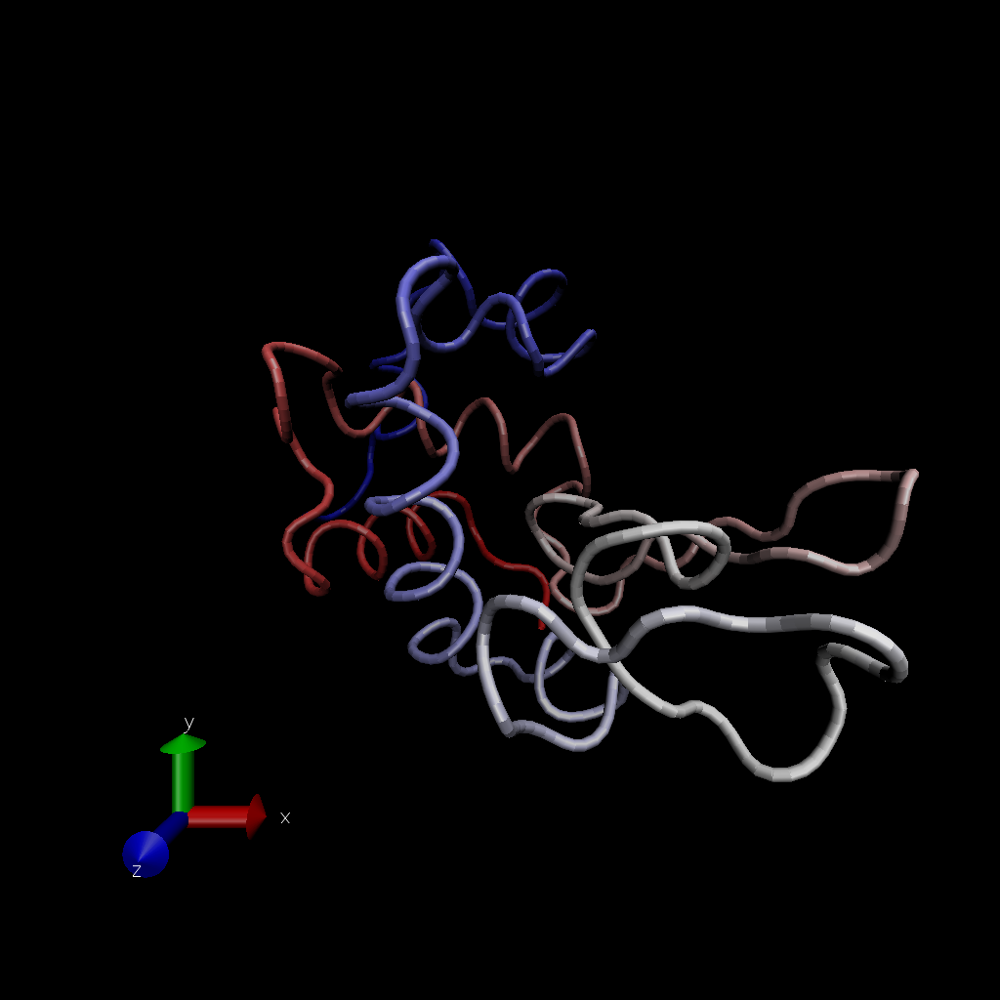
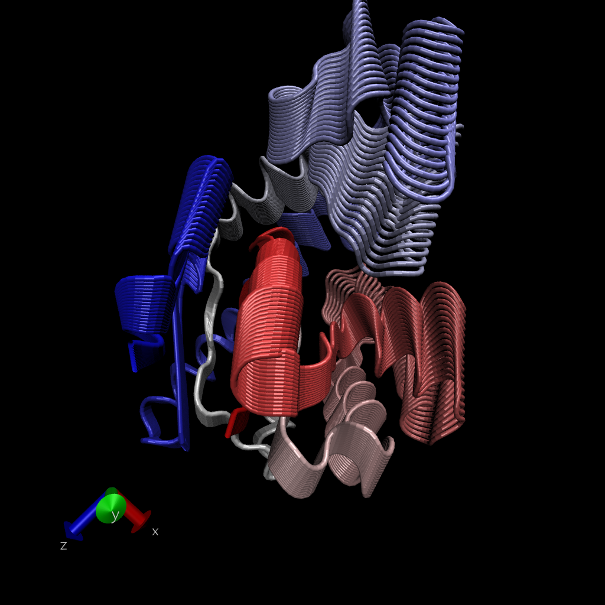

# Working with bio3d

```{r}
library(bio3d)
pdb <- read.pdb("1hel")
pdb
```

```{r}
head(pdb$atom)
```

Let's do a quick mathematic prediction of protein dynamics (flexibility). We use the 'nma()' function, which does Normal Mode Analysis.

```{r}
modes <- nma(pdb)
plot(modes)
```

Let's make a trajectory (movie) of this projection with 'mktrj()' function.

```{r}
mktrj(modes, file="nma.pdb")
```

Should knit to pdf. Not shwoing up in console.




Going to input a sequence and search pdb for structures.
Comparative analysis of the collection of structures.

## Comparative Structure Analysis

Start by getting a sequence of interest.

```{r}
aa <- get.seq("1AKE_A")
aa
```

> Q13. How many amino acids are in this sequence, i.e. how long is this sequence?

214 amino acids


I want to search the PDB databse (the main db for experimental structures) for sequences similar to my aa sequence. 

```{r}
blast <- blast.pdb(aa)
```

```{r}
hits <- plot(blast)
```

-log to get smaller numbers to work with?

Now I have my top hits from the search of the PDB. 

```{r}
hits$pdb.id
```

Here we download all these similar structures in the jPDB and store them on out computer.

```{r}
#Download related PDB files.
files <- get.pdb(hits$pdb.id, path="pdbs", split=TRUE, gzip=TRUE)

```

If you were to open this file in VMD it opens all proteins on top o each other. So, we want to align all these proteins first.

Next we will use the 'pdbaln()' function to align and also optionally fit (i.e. superpose) the identified PDB structures.

```{r}
# Align releated PDBs
pdbs <- pdbaln(files, fit = TRUE) 
```

Let's have a week look see

```{r}
pdbs
```


```{r}
# Vector containing PDB codes for figure axis
ids <- basename.pdb(pdbs$id)

# Draw schematic alignment
plot(pdbs, labels=ids)
```

```{r}
pdbs$xyz
```


## Principal Componenet Analysis (PCA)

Here we will do PCA on the xyz coordinate data of ll these strucutres with the 'pca()' function in bio3d.

```{r}
pc <- pca(pdbs)
plot(pc)
```

Each dot is a different protein structure. In the first graph we can see there is a distinct difference between the two categories separated PC1 v PC2.

Let's visualize the displacements (ie. movements of the strucutes) that are captured by PC1.

```{r}
mktrj(pc, pc=1, file="pca.pdb")
```





Let's save our important results.

```{r}
#save(blast, hits, pc, pdbs, file="myresults.RData")

```


